# S in MCP stands for Security

Presenter: Jitesh Thakur

## Abstract

The Model Context Protocol (MCP) is becoming a practical integration layer for connecting language-model systems to tools, data sources, and enterprise actions. That same convenience expands the attack surface. MCP does not simply expose another API; it changes how authority is discovered, selected, approved, invoked, and retained across hosts, clients, servers, tools, and backend systems. Tool metadata, prompts, retrieved content, tokens, runtime outputs, and approval paths can all become control surfaces. For security engineers and platform teams, familiar risks such as exposed services, over-broad credentials, injection, insecure sample code, and weak provenance now appear inside model-mediated execution paths rather than only at conventional application boundaries.

This paper accompanies the session “S in MCP stands for Security” and focuses on what practitioners can operationalize now. It draws on Microsoft’s public MCP guidance and enterprise patterns [1][2][3], OWASP’s MCP Top 10 [6], Project Hammer and Anvil [4], MITRE ATLAS attacker-behavior framing [7], the linked enterprise-security paper [8], transcript-backed public discussion [9][10], and local benchmark material from `mcp-security-bench` [11]. The paper argues that MCP should be treated as a delegated-authority security problem, not merely as a prompt-injection problem or a protocol-adoption problem. It proposes a five-control-plane operating model, a minimum day-1 rollout baseline, and an MCP Delegated-Authority Matrix that teams can use to prioritize mitigations by impact, likelihood, telemetry, ownership, and recovery action.

## 1. Introduction

MCP is attractive for the same reason it is risky: it makes useful connections easy. A client can discover tools, inspect metadata, invoke capabilities, and combine external context with model reasoning through a standardized interface [5]. In practice, that means faster delivery of copilots, agents, workflow assistants, and enterprise integrations. It also means that security decisions increasingly occur in places organizations do not always recognize as security boundaries: tool descriptions, schema hints, retrieval results, gateway policy, token brokering, response handling, and cross-tool execution flows.

For experienced defenders, the underlying failure modes are familiar. Exposed services, token leaks, SQL injection, command execution, excessive permissions, malicious dependencies, and weak observability are all well-understood problems. What changes in MCP is how those problems are surfaced and amplified. The model may choose the tool. The tool description may influence that choice. Content returned by one tool may steer the next action. A single leaked token may grant portable authority across a chain of tools. A seemingly helpful output may become an untrusted control channel for the next step. MCP security is therefore not just about prompt injection, and not just about API hardening. It is a delegated-authority operating-model problem.

This paper is intentionally practical rather than exhaustive. It does not attempt to catalog every public example or restate the protocol in full. Instead, it focuses on the questions teams need to answer now: how to frame MCP-enabled systems, where failures recur, which controls matter most, and how to threat-model the stack in a repeatable way [1][3][4][6][8][11].

## 2. MCP as a delegated-authority system

### 2.1 Why “delegated authority” is the right mental model

The most useful way to understand MCP security is to ask where authority moves. In a typical MCP-enabled workflow, some combination of user intent, service identity, brokered credentials, tool metadata, and policy enforcement determines whether a backend action occurs. That action may read data, write data, execute code, reach an external API, or trigger a consequential workflow. The security problem is therefore not only whether the model produces the right text. It is whether the surrounding system constrains the authority represented by available tools, credentials, and approval paths.

This framing is stronger than treating MCP primarily as a prompt problem. Prompts matter, but so do discovery, selection, invocation, result handling, and memory retention. The linked arXiv paper makes a similar enterprise point by dividing risk across hosts, clients, servers, tools, prompts, and external data/resources, then emphasizing layered controls across the full stack [8]. That component-aware view maps naturally to an authority-centric model: every component either carries, shapes, narrows, or expands what can be done.

### 2.2 The MCP execution loop as a security model

A practical way to operationalize that mental model is to break MCP workflows into six stages:

1. Discover: what tools and capabilities are visible to the model.
2. Select: which tool the model chooses.
3. Approve: what policy or user gating permits.
4. Invoke: what authority is exercised at runtime.
5. Return: what data, output, or error comes back.
6. Retain: what is stored, remembered, or reused later.

This matters because attacks and controls appear at different stages. A poisoned tool description affects discovery and selection. Over-broad credentials affect invocation. Unsafe output reuse affects return and retention. This stage model also aligns well with ATLAS-style attacker-behavior thinking without requiring a direct copy of its taxonomy [7]. The practical lesson is that MCP security must cover pre-execution, execution, and post-execution handling as distinct control surfaces.

Figure 1 visualizes the paper’s central claim: authority does not stop at the model boundary. It moves through the host, client, MCP server, tool runtime, and backend systems, and each lifecycle stage exposes different control opportunities.

## 3. Enterprise architecture: control plane over convenience

Once MCP is viewed as a delegated-authority system, architecture becomes the first security decision rather than an implementation detail.

### 3.1 A published reference pattern, not proof of solved maturity

One of the most useful contributions in Microsoft’s public guidance is architectural rather than merely tactical. The Azure guidance and associated enterprise-pattern material describe MCP deployment as a layered platform pattern built around MCP server capability plus centralized identity, gateway policy, private execution, data controls, and telemetry rather than unmanaged direct connections everywhere [1][2]. The top-level message is explicit defense in depth: no single safeguard is sufficient on its own.

That pattern matters because it reframes the problem correctly. The protocol itself is not the security model. Enterprises need a control plane around MCP exposure. A gateway or management layer provides a place to enforce authentication and authorization consistently, limit exposure, apply policy, broker access, log activity, and reduce the drift that appears when individual teams wire tools directly to agents without review [1][2]. Microsoft’s material is best treated as a useful published reference pattern, not as evidence that all relevant MCP controls are production-complete across the ecosystem.

For security engineers, the reference pattern suggests three practical principles:

1. Secure exposure should be the default path. If every team can publish MCP servers ad hoc, posture will vary widely.
2. Identity, policy, and telemetry should be centralized where possible. Ad hoc integrations rarely produce consistent least privilege or audit coverage.
3. Governance must start before runtime. Tool onboarding, review, and provenance are part of the security posture, not paperwork after the fact.

### 3.2 Tool design is part of the security boundary

Microsoft’s development-best-practices page adds a second crucial idea: poor tool design is itself a security and reliability risk [3]. The guidance argues that MCP tools should be designed for agent success, not API exhaustiveness. Teams should prefer task-oriented tools over exposing every backend operation as a separate low-level tool. They should also use valid input schemas, structured outputs that agents can act on safely, and actionable but sanitized error handling.

This is security-relevant for three reasons. First, too many granular tools increase selection ambiguity and make misuse more likely. Second, schema and output design influence how safely the model can reason about a capability. Third, leaky error messages can expose internal information back into the loop. Tool design, schema design, and error handling are therefore not only developer-experience concerns; they are part of the security boundary.

### 3.3 Deployment pattern choice is a security decision

The linked arXiv paper reinforces this architecture-first framing by describing several secure deployment patterns, including gateway-centric integration, dedicated security-zone deployment, and tightly governed microservice-oriented deployment [8]. The significance is not that one pattern universally wins. It is that deployment shape determines which control points are available and how much ad hoc trust each team must recreate locally. Secure architecture comes before secure prompting because architecture determines exposure, policy, telemetry, and isolation options.

## 4. Why MCP’s ease of use increases risk

That architecture-first framing also explains why ease of use is not a side issue in MCP security. It is one of the main risk drivers.

The first reason is straightforward: easier registration creates more tools, more quickly. Every new tool increases the number of reachable actions, trust relationships, and credentials in circulation. Teams that would never grant a monolithic application broad standing permissions may do so accidentally once those permissions are distributed across many small tools.

The second reason is that natural-language interfaces can obscure what is actually being delegated. A user sees a high-level request. The model sees tool metadata, argument schemas, retrieved text, and hidden control signals. That makes it easier for defenders to underestimate where security-sensitive behavior is determined.

The third reason is that convenience encourages weak review. A tool that feels local, internal, or experimental is more likely to be bound to the wrong address, shipped with a broad token, copied from sample code, or published without provenance checks. This is not unique to MCP, but MCP compresses the path from prototype to reachable capability.

The fourth reason is that model-mediated execution multiplies blast radius. A poorly reviewed tool is already risky. A poorly reviewed tool that can be discovered automatically, invoked in chains, and combined with enterprise credentials is materially worse. The local benchmark materials illustrate the point well: some obvious metadata attacks are catchable with simple scanning, but semantically plausible malicious behavior remains much harder to detect reliably [11]. The takeaway is not that scanning is useless. It is that convenience outpaces review unless organizations deliberately insert controls.

## 5. Three recurrent failure buckets

Those risk drivers tend to cluster into three recurrent failure buckets.

### 5.1 Exposure and sample-code failures

One recurring public failure pattern is the MCP surface that is exposed more broadly than intended, including unsafe local defaults and broad bind addresses. This is the kind of mistake defenders recognize immediately: a development-oriented service becomes reachable beyond its intended audience. In MCP deployments, that risk is heightened by tooling patterns that prioritize local-first or debug-friendly development.

A related problem is the sample-code trap. Reference or demo code often teaches protocol usage, not production hardening. Teams frequently fork examples into environments that later gain real data access or privileged credentials. Unsafe query construction, weak validation, or permissive defaults can survive that transition if reference is mistaken for secure.

The combined lesson is simple: internal-only assumptions and reference code are not controls. Bind-address hygiene, network segmentation, authentication at the edge, and full secure code review still matter.

### 5.2 Delegated-authority failures

Token leaks remain one of the fastest ways to lose control of a tool chain. In MCP systems, a token is not just a secret; it is portable execution authority. Over-scoped OAuth grants, long-lived bearer tokens, and shared credentials allow a compromise in one workflow to become lateral movement across multiple tools or data sources. The user-provided transcript adds a helpful framing here: confused-deputy failures become likely when an MCP server acts with broader stored or server-side authority than the requesting user should actually have [9].

The lesson is that traditional identity discipline becomes more important, not less, in agentic systems. Tokens should be short-lived, narrowly scoped, brokered where possible, and separated by tool, action, tenant, and environment. Gateways should replace broad forwarded authority with tool-specific, short-lived connector credentials where appropriate rather than blindly preserving maximum authority [9].

### 5.3 Context and trust failures

Indirect prompt injection is a central MCP problem because the model can consume untrusted content from many places: retrieved documents, tickets, web pages, tool results, and server-provided metadata [6][9][10]. A malicious instruction no longer needs to come from the user. It can arrive through the content the system is designed to retrieve or the tools it is designed to trust.

MCP also creates an attacker opportunity that is less visible in conventional systems: competing to be selected. A malicious tool does not need to look obviously malicious. It can present a plausible name, a useful description, and a legitimate-seeming interface. Shadowing, poisoned metadata, and rug pulls all exploit the fact that trust can be manipulated before runtime [4][10][11]. The combined lesson is that context is untrusted and trust itself is attackable.

## 6. A five-control-plane operating model

To turn those failure buckets into an operating model, it is more useful to group safeguards into five control planes than to maintain one long, unprioritized checklist.

### 6.1 Architecture control plane

This plane determines where MCP is exposed and what surrounds it. Controls include gateway placement, private networking, security-zone decisions, centralized policy enforcement, and telemetry integration [1][2][8]. Architecture choice is itself a security decision because it determines which controls are available by default.

### 6.2 Tool trust control plane

This plane determines what becomes discoverable and why. Project Hammer and Anvil is especially useful here because it treats tool security as a governed lifecycle with owner mapping, review state, provenance, version pinning, change control, and validation against shadowing or hidden-description abuse [4]. Before a tool becomes discoverable, teams should know who owns it, what business action it serves, what permissions it needs, what environment it can reach, and what changed in the latest release.

### 6.3 Delegated-authority control plane

This plane governs credentials, scope, approval, and privilege boundaries. Strong patterns include short-lived scoped credentials, tool-specific brokers, audience and sender constraints, separation of read, write, and admin capabilities, and stronger approvals for destructive or high-consequence actions [1][3][8][9]. The guiding principle is that authority should shrink as it moves, not remain maximally portable across the chain.

### 6.4 Context-integrity control plane

This plane governs schemas, outputs, retrieved content, metadata, and errors. Structured inputs and outputs reduce ambiguity. Unknown-field rejection, normalization, redaction, semantic validation, and sanitized recoverable errors reduce both attack opportunity and accidental misuse [3][8]. Tool output and retrieved content should be treated as untrusted input to the next reasoning step unless explicitly validated.

### 6.5 Containment-and-telemetry control plane

This plane determines whether a bad decision becomes an incident or a catastrophe. Runtime sandboxing, filesystem and process restrictions, egress allowlists, cross-tool chaining controls, end-to-end tracing, anomaly detection, audit logging, and MCP-specific response playbooks all belong here [4][8][11]. Good telemetry should help operators debug and help defenders investigate; the best controls improve both security and operability.

Figure 2 compresses the operating model into five planes that practitioners can reason about separately while preserving the fact that real incidents usually cross more than one plane.

## 7. Day-1 baseline and 90-day rollout guidance

With that operating model in place, rollout guidance becomes more concrete.

### 7.1 Minimum day-1 production baseline

Before an MCP-enabled workflow becomes discoverable in production, teams should be able to show at least the following:

1. A registry entry with a named owner and business purpose.
2. A scoped credential policy for the workflow.
3. Approval gating for destructive or high-consequence actions.
4. Mandatory telemetry fields for discovery, approval, invocation, and response.
5. A containment baseline: sandboxing and/or egress restriction appropriate to the workflow.
6. A linked incident response playbook or operational escalation path.

This baseline does not solve every problem. It does establish a minimum standard that platform teams can actually enforce.

### 7.2 30–90 day rollout measures

In the medium term, organizations should standardize gateway patterns, formalize onboarding workflows, add metadata and response scanning, build incident playbooks specific to MCP misuse, and establish clear role ownership for policy, registry review, and runtime monitoring [2][4][8]. The goal is repeatability rather than heroics.

### 7.3 Long-term measures

Over time, mature ecosystems should move toward stronger registries, signed artifacts, continuous recertification, richer provenance attestation, policy-aware clients, and secure-by-construction MCP platforms [4][8][9]. Long-term maturity is less about one more scanner and more about making trustworthy behavior the default operating mode.

## 8. Continuous validation: logic, protocol, and agent behavior

Controls are only credible if they are validated continuously. Microsoft’s development guidance offers a reusable testing model: validate MCP systems at three layers [3].

1. Unit tests for tool logic and local policy behavior.
2. Protocol tests for MCP compliance and error handling.
3. Agent tests for discoverability, selection, argument construction, and recovery behavior.

This split matters because a secure tool that is consistently mis-selected is still a security problem. Operationally, logic and protocol tests fit naturally into every-commit workflows, while agent-behavior tests are a better fit for pull requests or nightly runs because they are slower but closer to real deployment behavior [3]. For platform teams, this turns secure MCP rollout from an abstract aspiration into a concrete validation plan.

## 9. The MCP Delegated-Authority Matrix

### 9.1 Why a new matrix is useful

Threat modeling for MCP should produce prioritized action, not only a well-drawn architecture diagram. Inspired by ATLAS’s attacker-behavior mindset, the enterprise-grade MCP paper’s component-aware framing, and the general structure of appendix-style threat matrices used in conference talks, this paper proposes an MCP Delegated-Authority Matrix tailored to MCP’s actual lifecycle [7][8].

The goal is to capture realistic abuse stories in a form that security engineers, platform teams, and service owners can all use.

### 9.2 Recommended matrix shape

The most usable presentation separates a core matrix from a team worksheet.

The core matrix should remain intentionally small and memorable. A good starter shape uses only five fields:

- Risk
- Stage
- First control
- Owner
- Priority

That is enough for a keynote artifact because it answers the first operator questions that matter in a rollout meeting: what can go wrong, where it happens, what should stop it first, who owns that control, and how urgently it should be handled.

The team worksheet can remain richer for implementation work. Teams may still track:

- Threat ID and domain
- Attacker goal
- Trust plane / flow stage
- Asset or capability at risk
- Impact
- Likelihood
- Primary guardrail + owner
- Detection signal / quick test
- Priority
- Recovery action

This split matters because many threat models fail through overdesign. A dense worksheet can be useful for engineering, but it often fails as a communication tool or adoption aid. The simplification is not a loss of rigor; it is a sequencing choice.

Figure 3 shows the intended division of labor between the concise matrix shown in the talk and the richer engineering worksheet. The paper can preserve both, while the talk should emphasize only the smaller, faster-to-use form.

### 9.3 Example matrix rows

OWASP MCP Top 10 is a strong source of seed rows for a first-pass matrix [6]. It should not replace system-specific threat modeling, but it gives teams a practical way to begin coverage before their own workflow-specific abuse cases are fully enumerated.

Table 1 illustrates six starter rows drawn from OWASP MCP Top 10 categories and rewritten into the delegated-authority matrix format.

| Risk | Stage | First control | Owner | Priority |
|---|---|---|---|---|
| MCP01 — Secret exposure via logs, memory, or prompt traces | Return / retain | Remove secrets from prompts, logs, and long-lived memory; broker short-lived credentials | IAM + Platform | P0 |
| MCP02 — Scope creep enables unintended write or admin actions | Approve / invoke | Split read/write/admin privileges and enforce scoped tokens per tool | IAM + Platform | P0 |
| MCP03 — Tool poisoning biases selection or corrupts outputs | Discover / select | Registry review, provenance checks, and recertification for discoverable tools | Platform + Security Eng | P1 |
| MCP05 — Untrusted input reaches shell, code, or execution surface | Invoke | Replace raw execution with bounded task tools and strict argument validation | Engineering + Security Eng | P0 |
| MCP09 — Shadow MCP server bypasses governance and telemetry | Discover / invoke | Require gateway registration and block unapproved MCP endpoints | Platform + SOC | P1 |
| MCP10 — Context over-sharing leaks data across users, sessions, or tasks | Return / retain | Scope context per task and user; minimize retained sensitive state | Product + Platform | P1 |

For stage delivery, these six rows should usually be collapsed into two visible buckets:

- Fix now: MCP01, MCP02, MCP05
- Harden next: MCP03, MCP09, MCP10

That simplification preserves breadth while keeping prioritization visible. The fuller six-row table belongs in the paper, appendix, or team worksheet.

## 10. Conclusion

MCP is valuable because it lowers the cost of useful integration. That same property changes security posture quickly. The protocol increases the number of callable actions, the amount of reachable data, and the number of places where trust decisions are made. Exposed surfaces, delegated-authority failures, context steering, trust manipulation, weak provenance, and weak observability are therefore not edge cases. They are predictable outcomes when model-driven systems are connected to real capabilities without an explicit control plane.

The strongest lesson across Microsoft’s public guidance, Project Hammer and Anvil, attacker-behavior thinking inspired by ATLAS, the linked research paper, transcript-backed examples, and local benchmark material is that no single defense is enough [1][2][3][4][7][8][9][10][11]. What works is layering architecture, tool trust, identity brokering, validation, containment, observability, and ownership so that one failure does not become total compromise.

The practitioner takeaway is direct: treat MCP as a governed delegated-authority layer from day one. If the model can reach it, the security model must explain it. That explanation should cover who can publish tools, how tools become discoverable, what credentials they receive, what they are allowed to reach, how their output is handled, how misuse is detected, who owns each control, and how trust is revoked when something goes wrong. Teams can adopt MCP quickly, but they should do so only with security moving at the same pace.

## References

[1] Microsoft. "OWASP MCP Top 10 Security Guidance for Azure." https://microsoft.github.io/mcp-azure-security-guide/

[2] Microsoft. "Enterprise Patterns & Lessons Learned." https://microsoft.github.io/mcp-azure-security-guide/adoption/enterprise-patterns/

[3] Microsoft. "Development Best Practices for MCP Servers." https://microsoft.github.io/mcp-azure-security-guide/adoption/development-best-practices/

[4] Jitesh Thakur. "Project Hammer and Anvil." https://jitha-afk.github.io/ProjectHammerAndAnvil/ and https://github.com/Jitha-afk/ProjectHammerAndAnvil

[5] Model Context Protocol. "Specification." https://modelcontextprotocol.io/specification

[6] OWASP Foundation. "OWASP MCP Top 10." https://owasp.org/www-project-mcp-top-10/

[7] MITRE ATLAS. "ATLAS Matrices." https://atlas.mitre.org/matrices/ATLAS

[8] "Enterprise-Grade Security for the Model Context Protocol (MCP): Frameworks and Mitigation Strategies." arXiv:2504.08623. https://arxiv.org/abs/2504.08623

[9] User-provided transcript of "MCP Security Survival Guide: Best Practices, Pitfalls & Real-World Lessons." Local source at `/home/sealjitha/projects/ProjectOpenHandMonk/poc/mcp-security-bench/docs/presentation/sources/youtube_transcript_mcp_security_survival_guide.md`.

[10] "The MCP Security Survival Guide: Best Practices, Pitfalls, and Real-World Lessons." Towards Data Science, Aug. 6, 2025.

[11] ProjectOpenHandMonk. Local MCP benchmark and attack-taxonomy materials under `poc/mcp-security-bench/docs/`.
